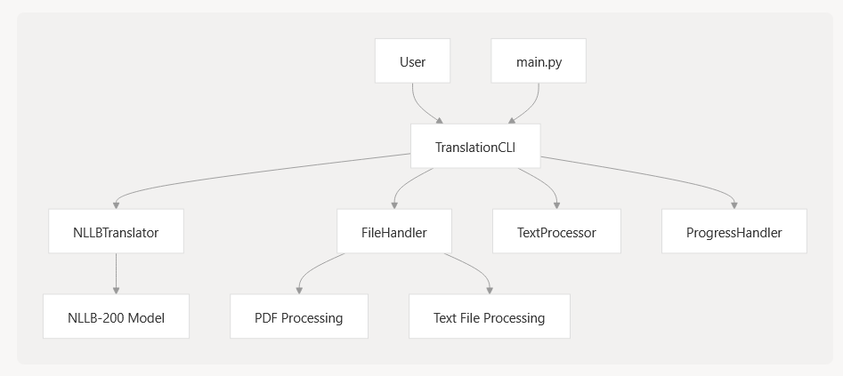
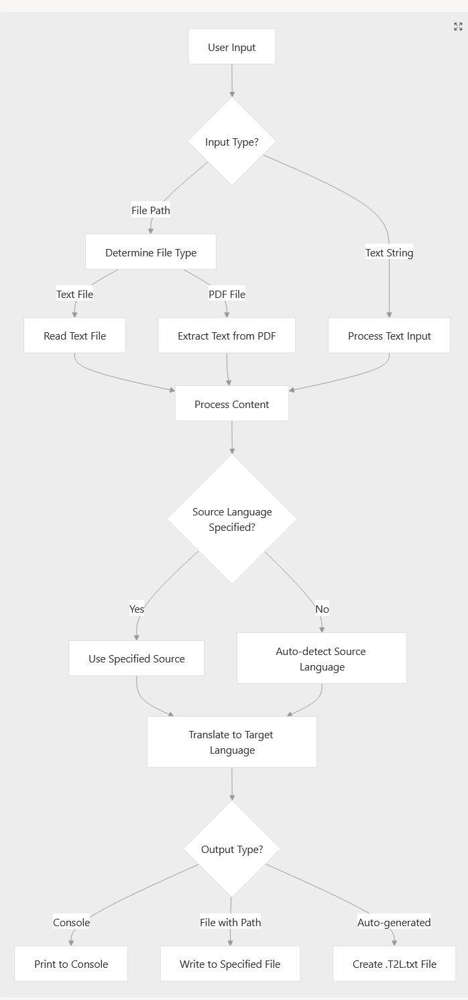
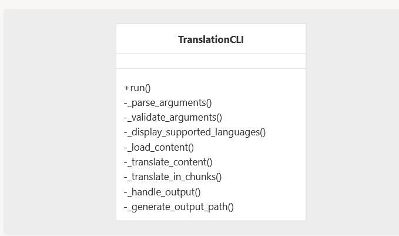
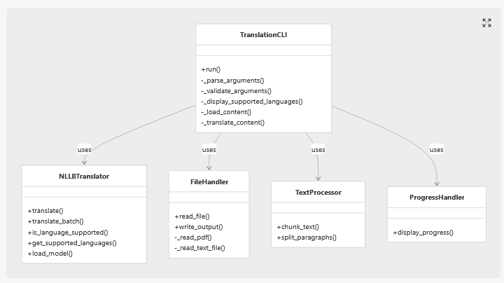
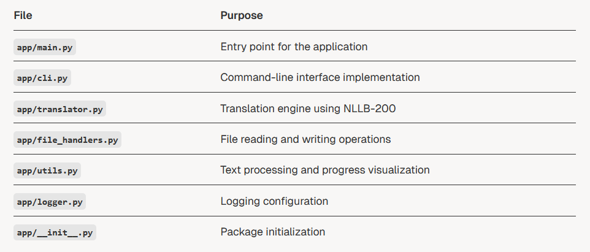

## L2T - Language 2 Translate

## Purpose and Scope
L2T (Language 2 Translate) is a command-line translation system that leverages the NLLB-200 (No Language Left Behind) neural machine translation model to provide translation capabilities across 200+ languages. This document provides a high-level overview of the system's architecture, components, and functionality. For installation instructions, see Installation and Setup; for usage instructions, see Command-Line Interface.

## System Overview
L2T is structured as a modular command-line application that allows users to translate text directly or from files, with support for both text files and PDFs. The system handles language detection, translation, and output generation through a pipeline of specialized components.



## Core Components
### Translation CLI

The TranslationCLI class serves as the central orchestrator for the translation process. It processes command-line arguments, validates inputs, manages the translation workflow, and handles output generation.

### Translation Engine

The NLLBTranslator class implements the core translation functionality using the NLLB-200 model. It provides methods for translating text, checking language support, and retrieving available languages.


### File Handlers

The FileHandler class manages reading from and writing to different file formats, including text files and PDFs. It abstracts away the complexity of dealing with different file types.
Utilities

    . TextProcessor: Handles text manipulation tasks such as chunking text into manageable segments for translation
    - ProgressHandler: Manages progress visualization during translation

### Logger
Provides logging capabilities throughout the system for tracking operations and troubleshooting.


## Translation Workflow
The following diagram illustrates the step-by-step process of translation in L2T:



L2T provides a rich command-line interface with various options for controlling the translation process:

### Command-Line Interface
L2T provides a rich command-line interface with various options for controlling the translation process:



The CLI supports the following operations:

    Translating text strings directly
    Translating text files
    Translating PDF documents
    Specifying source and target languages
    Controlling output destination
    Setting performance parameters (chunk size, batch size)

### Technical Specifications
System Components Relationship
The following diagram illustrates the relationships between the main classes in the L2T system:



## Dependencies

L2T relies on several key technologies:

    PyTorch: For neural network operations
    Transformers library: To load and run the NLLB-200 model
    PyPDF2: For PDF file processing
    Accelerate: For optimized model inference

## Language Support

The system supports over 200 languages through the NLLB-200 model, using language codes in the format xxx_Latn (e.g., eng_Latn for English, fra_Latn for French).

## File Structure
The codebase follows a clean, modular organization:




# Structure
```markdown
Directory structure:
└── olivierlavaud-l2t/
    ├── README.md
    ├── pyproject.toml
    ├── requirements.txt
    ├── uv.lock
    ├── .python-version
    ├── app/
    │   ├── README.md
    │   ├── __init__.py
    │   ├── cli.py
    │   ├── file_handlers.py
    │   ├── logger.py
    │   ├── main.py
    │   ├── optimizations.py
    │   ├── translator.py
    │   ├── utils.py
    │   └── minimal/
    │       ├── README.md
    │       ├── cli-nllb.py
    │       ├── nllb copy 2.py
    │       └── test-nllb.py
    ├── docs/
    │   ├── Le_Lievre_et_la_Tortue.txt
    │   └── Le_Petit_Prince_ASE.eng-Latn.T2L.txt
    └── gpu/
        ├── gpu_check.py
        ├── gpu_sync.py
        ├── gpu_verif.py
        └── gpu_version.py
```
# Installation

```bash
git clone https://github.com/OlivierLAVAUD/L2T.git
cd L2T
```

# Example Usage

- Help command line and language List
```bash
uv run -m app.main --help
uv run  -m app.main --list-languages
```

## Samples

```bash

1. Translate a text string to French:
uv run -m app.main "Texte à traduire" -l fra_Latn

2. Translate a text string from French to English:
uv run -m app.main "Texte à traduire" -l eng_Latn -s fra_Latn

3. Translate a file and save the output:
uv run -m app.main "Texte à traduire" -l eng_Latn -s fra_Latn -o my_translated_file.txt

4. Translate a PDF document:
# for Generating automatically a T2L file: my_file_to_translate.T2L.txt
uv run  -m app.main my_file_to_translate.txt -l eng_Latn -s fra_Latn

uv run -m app.main docs/Le_Lievre_et_la_Tortue.txt -l eng_Latn -s fra_Latn
uv run -m app.main docs/Le_Petit_Prince_ASE.pdf -l eng_Latn -s fra_Latn
```
