# L2T - Language 2 Translate

## Purpose and Scope
L2T (Language 2 Translate) is a command-line translation system that leverages the NLLB-200 (No Language Left Behind) neural machine translation model to provide translation capabilities across 200+ languages. 

## System Overview
L2T is structured as a modular command-line application that allows users to translate text directly or from files, with support for both text files and PDFs. The system handles language detection, translation, and output generation through a pipeline of specialized components.

## Language Support

The system supports over 200 languages through the NLLB-200 model, using language codes in the format xxx_Latn (e.g., eng_Latn for English, fra_Latn for French, ...).

# File Structure
The codebase follows a clean, modular organization:

```mermaid
flowchart LR
    %% Direction FLux
    direction LR
    
    %% Styles
    classDef folder fill:#f0f7ff,stroke:#0366d6,stroke-width:2px
    classDef file fill:#fff,stroke:#333,stroke-width:1.5px

    %% Structure racine
    root(["📁 L2T"]):::folder

    %% Fichiers racine
    root --> F1["📄 README.md"]
    root --> F2["⚙️ pyproject.toml"]
    root --> F3["🐍 .python-version"]

    %% Dossier app et son contenu
    root --> app(["📂 app"]):::folder
    app --> A1["🐍 __init__.py"]
    app --> A2["💻 cli.py"]
    app --> A3["📕 file_handlers.py"]
    app --> A4["📝 logger.py"]
    app --> A5["⚡ main.py"]
    app --> A6["🚀 optimizations.py"]
    app --> A7["🌐 translator.py"]
    app --> A8["🛠️ utils.py"]

    %% Sous-dossiers
    app --> docs(["📚 docs"]):::folder
    app --> gpu(["🎮 gpu"]):::folder

    %% Style des liens
    linkStyle default stroke:#999,stroke-width:1px
```



# Infrastructure Diagram


# Prerequisite
    - uv: The extremely fast Python package and project manager (https://docs.astral.sh/uv/getting-started/installation/)
    - Hugginface CLI Access

# Installation

### Step 1: Clone the Repository

    ```bash
    git clone https://github.com/OlivierLAVAUD/L2T.git
    cd L2T
    ```

### Step 2: Verify Installation

Run a simple command to verify that L2T is functioning correctly:
```bash
    uv run -m app.main --list
```
    This command should display a list of supported languages, indicating that the system is properly installed and the NLLB-200 model is accessible.
    

### Step 3 (Optional):  Install the packages for Cuda (ex for cu118)
    ```bash
        # check your gpu
        uv run gpu/gpu_check.py

        # Install the right depedencies of Pytorch (ex cu118 for example)
        uv pip install torch torchvision torchaudio --index-url https://download.pytorch.org/whl/cu118
    ```

### Step 4:  Create an Alias

#### For PowerShell (Windows)

1. Execute the PowerShell Script file: l2t.ps1
    ```powershell
    # load and execute the script in the current session
        . .\l2t.ps1
    ```
2. Test:
    ```powershell
   l2t --list
    ```

#### For Unix (Linux/macOS)

1. Open your shell config file (~/.bashrc, ~/.zshrc, etc.):
    ```bash
        nano ~/.bashrc  # Pour Bash
    ```

2. Add the function + alias:
    ```bash
        alias l2t='uv run -m app.main "$@"'
    ```

3. Reload the config:
    ```bash
        source ~/.bashrc
    ```

# Usage

1. Translate a text string to French:
    ```bash
    l2t "Text to translate" -t fra_Latn
    ```

2. Translate a text string from French to English and specifying source language:
    ```bash
    l2t "Texte à traduire" -t eng_Latn -s fra_Latn
    ```

3. Translate a file and save the output on a specific name:
    ```bash
    l2t "Texte à traduire" -t eng_Latn -s fra_Latn -o my_translated_file.txt
    ```

4. Translate a PDF ou TXT document from CLI with a automatic filename extension (T2L.txt) recording:
    ```bash
    l2t -f docs/book.txt -t eng_Latn -s fra_Latn
    l2t -f docs/book.pdf -l eng_Latn -s fra_Latn
    ```
5. For more details see manual
    ```bash
    l2t --help
    ```
# Documentation

[https://deepwiki.com/OlivierLAVAUD/L2T](https://deepwiki.com/OlivierLAVAUD/L2T)

 
