# L2T - Language 2 Translate

## Purpose and Scope
L2T (Language 2 Translate) is a command-line translation system that leverages the NLLB-200 (No Language Left Behind) neural machine translation model to provide translation capabilities across 200+ languages. 

## System Overview
L2T is structured as a modular command-line application that allows users to translate text directly or from files, with support for both text files and PDFs. The system handles language detection, translation, and output generation through a pipeline of specialized components.

## Language Support

The system supports over 200 languages through the NLLB-200 model, using language codes in the format xxx_Latn (e.g., eng_Latn for English, fra_Latn for French, ...).

# File Structure
The codebase follows a clean, modular organization:

```mermaid
flowchart TD
    %% Configuration globale
    classDef folder fill:#E3F2FD,stroke:#42A5F5,stroke-width:2px
    classDef file fill:#E8F5E9,stroke:#66BB6A,stroke-width:1.5px
    classDef config fill:#FFF3E0,stroke:#FFA726
    classDef python fill:#E1F5FE,stroke:#0288D1
    classDef markdown fill:#F3E5F5,stroke:#AB47BC

    %% Structure racine
    root["📦 olivierlavaud-l2t/"]
    root:::folder --> README["📄 README.md"]
    README:::markdown
    root --> pyproject["⚙️ pyproject.toml"]
    pyproject:::config
    root --> python_version["🐍 .python-version"]
    python_version:::config

    %% Sous-dossier app
    subgraph app["📂 app/"]
        direction TB
        app_readme["📄 README.md"]:::markdown
        app_init["__init__.py"]:::python
        cli["🖥️ cli.py"]:::python
        file_handlers["📂 file_handlers.py"]:::python
        logger["📝 logger.py"]:::python
        main["⚡ main.py"]:::python
        optimizations["🚀 optimizations.py"]:::python
        translator["🌐 translator.py"]:::python
        utils["🛠️ utils.py"]:::python
    end
    app:::folder

    %% Autres dossiers
    root --> docs["📚 docs/"]:::folder
    root --> gpu["🎮 gpu/"]:::folder
```




# Prerequisite
    . uv: The extremely fast Python package and project manager (https://docs.astral.sh/uv/getting-started/installation/)
    . Hugginface CLI Access

# Installation

### Step 1: Clone the Repository

```bash
git clone https://github.com/OlivierLAVAUD/L2T.git
cd L2T
```

### Step 2: Verify Installation

Run a simple command to verify that L2T is functioning correctly:
```bash
uv run -m app.main --list-languages
# or with alias
l2t --list

This command should display a list of supported languages, indicating that the system is properly installed and the NLLB-200 model is accessible.
```

### Step 3:  Create an Alias

#### For PowerShell (Windows)

1. Open your PowerShell profile:
    ```powershell
    notepad $PROFILE
    ```
2. Add the function + alias:
```powershell

function l2t {
    param(
        [string]$Text,
        [string]$Language = "fra_Latn"  # Default: French
    )
    uv run -m app.main $Text -l $Language
}
Set-Alias -Name lt -Value l2t  # Short alias
```
.. or more simply, do it simply with the provided powershell script
```powershell
.\l2t-alias.ps1
```

3. Reload the profile:
```powershell
     Set-ExecutionPolicy RemoteSigned -Scope CurrentUser # for unblocking the security policy (only if needed in the case of current user session)
     
     . $PROFILE

```

#### For Unix (Linux/macOS)

1. Open your shell config file (~/.bashrc, ~/.zshrc, etc.):
    ```bash
       nano ~/.bashrc
    ```

2. Add the function + alias:
```bash

l2t() {
    local text="$1"
    local lang="${2:-fra_Latn}"  # Default: French
    uv run -m app.main "$text" -l "$lang"
}
alias lt="l2t"  # Short alias (optional)
```

3. Reload the config:
```bash
    source ~/.bashrc
```

# Usage

1. Translate a text string to French:
```bash
l2t "Text to translate" -l fra_Latn
```

2. Translate a text string from French to English and specifying source language:
```bash
l2t "Texte à traduire" -l eng_Latn -s fra_Latn
```

3. Translate a file and save the output on a specific name:
```bash
l2t "Texte à traduire" -l eng_Latn -s fra_Latn -o my_translated_file.txt
```

4. Translate a PDF ou TXT document from CLI with a automatic filename extension (T2L.txt) recording:
```bash
l2t <my_pdf_or_txt_file_to_translate> -l eng_Latn -s fra_Latn

# Others samples
l2t docs/Le_Lievre_et_la_Tortue.txt -l eng_Latn -s fra_Latn
l2t docs/Le_Petit_Prince_ASE.pdf -l eng_Latn -s fra_Latn
```
5. For more details see manual
```bash
l2t --help
```

# Infrastructure


# Documentation

[https://deepwiki.com/OlivierLAVAUD/L2T](https://deepwiki.com/OlivierLAVAUD/L2T)

 
